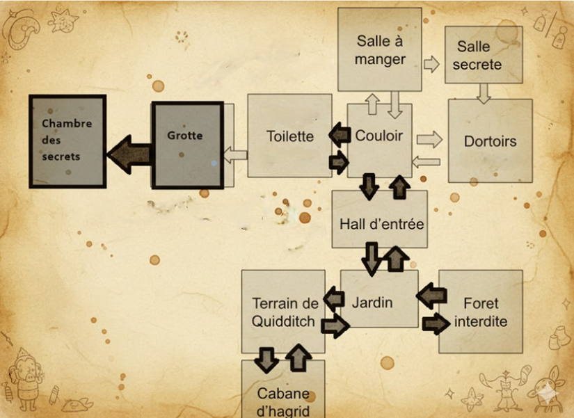
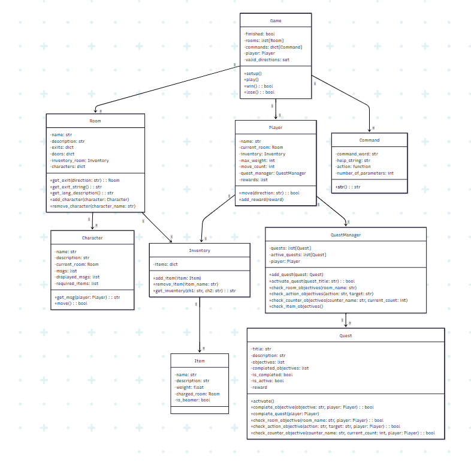

# Poudlard Adventure Game

Un jeu d'aventure textuel inspiré de l'univers de Poudlard.

---

## Guide Utilisateur

### Description

Plongez dans l'univers magique de Poudlard à travers ce jeu d'aventure textuel. Vous incarnez un élève de Poudlard qui doit explorer le château, interagir avec des personnages emblématiques et collecter des objets magiques pour accomplir des quêtes.

### Univers

Le jeu se déroule dans le château de Poudlard et ses environs. Vous pourrez explorer :
- Le Hall d'entrée
- La Grotte
- Les Toilettes
- Le Couloir
- Les Dortoirs
- La Salle secrète
- La Salle à manger
- Le Jardin
- Le Terrain de Quidditch
- La Cabane d'Hagrid
- La Forêt interdite
- La Chambre des Secrets



### Personnages non joueur
Plusieurs personnages non joueur se trouvent dans l'école de Poudlard et ses alentours:
- McGonagall
- Dobby
- Crabbe
- MimiGeignard (qui peut se déplacer à travers la carte)
- Hagrid
### Conditions de Victoire

Pour gagner la partie, vous devez compléter toutes les quêtes disponibles :
1. **Explorateur de Poudlard** : Atteindre la Chambre des Secrets.
2. **Petit collectionneur** : Obtenir les 6 objets magiques.
3. **Bavardeur magique** : Interagir avec Dobby.

### Conditions de Défaite

Vous perdrez la partie si vous entrez dans la Grotte sans posséder les 5 objets magiques nécessaires :
- Baguette
- Mandragore
- Œuf de dragon
- Torche
- Balai

### Installation

1. Clonez le dépôt GitHub :
   ```bash
   git clone [https://github.com/aurelien-mopty/TBA]

2. Lancez le jeu avec la commmande : 
```bash
python ./game.py
```


| Commande | Description |
| :------ | :-----: |
| help |Affiche la liste des commandes disponibles. |
| quit | Quitte le jeu.| 
| go <direction> | Se déplacer dans une direction (N, E, S, O, U, D).| 
| history | Affiche l'historique des pièces visitées.| 
| back | Retourne en arrière.| 
| check | Affiche l'inventaire du joueur.| 
| look | Affiche l'inventaire de la pièce actuelle.| 
| take <item> | Prend un objet dans la pièce.| 
| drop <item> | Dépose un objet dans la pièce.| 
| charge | Charge une pièce avec un beamer (Poudre de cheminette).| 
| use <item> | Utilise un beamer pour se téléporter dans la pièce chargée.|
| unlock <dir> | Déverrouille une porte dans une direction donnée.|
| talk <PNJ>| Interagit avec un personnage non-joueur (PNJ).|
| quests | Affiche la liste des quêtes.|
| quest <titre> | Affiche les détails d'une quête spécifique.|
| activate <titre>| Active une quête spécifique.|
| rewards | Affiche les récompenses obtenues.|

## Guide Developpeur

### Diagramme de classes:




## Perspectives de Développement
Voici quelques ameliorations que nous aurions pu ajouter à notre jeu TBA :

### Developpement des personnages non joueur
Le role et les capacités des personnages non joueur qui sont assez limités dans notre jeu. Il n'y en a que 5 ayant tous maximum deux repliques. Un seul ne sert vraiment au cours du jeu et un seul a la capacité de se deplacer.Voici quelques possibilités d'améliorations pour nos PNJ:

- Leur donner plus de dialogues et surtout des dialogues à choix 
- Leur donner des réactions differentes en fonction de l'inventaire (déja fait avec Dobby mais assez limité) et des queêtes (par exemple un PNJ qui nous félicite si on finit le jeu)
- Ajout de dialogues à choix multiples( qui aurait un impact sur les reponses des PNJ)

### Enrichissement des quêtes

Les quêtes restent assez limitées et servent toutes à finir le jeu. Voici quelques possibilités de développement pour les quêtes:

- Ajout de quêtes à embranchement (avec un choix que le joueur doit faire pour la suite du jeu)
- Ajout de quêtes secondaires pour rallonger le temps de jeu.

### **Bon jeu !**


